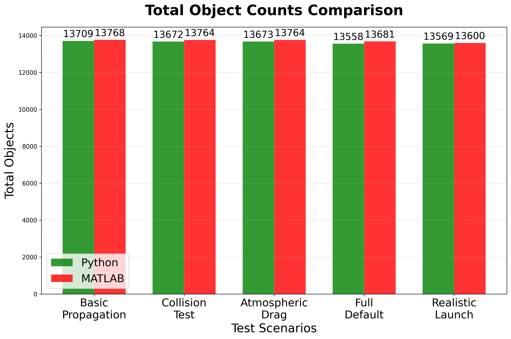
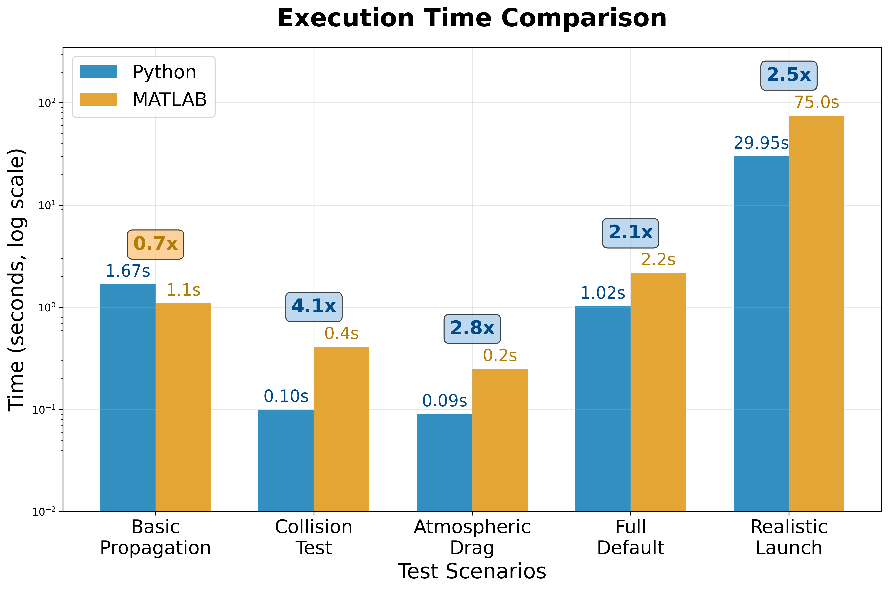
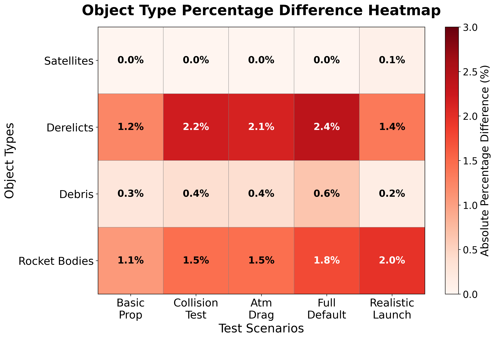

# Summary

The growth of satellite deployments and large-scale constellations has made orbital sustainability an urgent concern. Simulating the evolution of the space environment requires tools that are both computationally efficient and compatible with modern research workflows. The MIT Orbital Capacity Assessment Toolbox Monte Carlo module (MOCAT-MC) is a leading framework for modeling space traffic and debris risk, but its MATLAB implementation limits accessibility due to licensing requirements and hinders integration with state-of-the-art machine learning algorithms and Python-based data science pipelines central to contemporary space sustainability research.

PyMOCAT-MC is a complete Python reimplementation of MOCAT-MC, designed to maintain full functional compatibility with the original toolbox while improving performance, modularity, and accessibility. The translation involved converting more than 150 MATLAB functions into Python, preserving the core algorithms while restructuring them for clarity and efficiency within Python’s scientific computing ecosystem. The resulting codebase comprises over 8,600 lines in Python and leverages open-source libraries including NumPy, SciPy, pandas, and Matplotlib.

Benchmarking against the MATLAB version shows that PyMOCAT-MC achieves a mean relative error of 0.96% and a maximum error of 2.38% across all tested scenarios. Performance tests demonstrate speed gains of up to four times, with the “Realistic Launch” scenario completing in under 30 seconds in Python compared to over 75 seconds in MATLAB. This combination of high accuracy and faster execution enables more extensive simulation campaigns and facilitates integration into a wider range of research and policy workflows.

# Statement of need

As the orbital environment becomes more congested, the ability to model collisions, debris evolution, and the long-term sustainability of satellite operations has significant implications for both policy-making and engineering design [@jang2025newmontecarlo]. The original MOCAT-MC toolbox [@arclab2025mocatmc] has been used by researchers to perform Monte Carlo–based assessments of orbital capacity, yet its MATLAB implementation limits accessibility for researchers and organizations that rely on open-source tools. It also presents barriers to integrating with state-of-the-art machine learning frameworks and Python-based data analysis workflows, which are increasingly central to advancing space situational awareness modeling. These constraints can hinder collaboration, slow down simulation work, and restrict the adoption of the software in the broader space sustainability community.

PyMOCAT-MC addresses these barriers by delivering a functionally equivalent, open-source Python version that is free to use and modify. The Python implementation not only replicates the original capabilities but also improves runtime performance and introduces a modular design that makes it easier to integrate with other orbital mechanics packages such as Astropy or poliastro, as well as related tools like MOCAT-pySSEM [@brownhall2025mocatpySSEM]. The open-source nature of the project supports reproducibility, encourages community contributions, and creates opportunities for extending the toolbox to new modeling approaches, such as agent-based simulations of satellite behavior.

# Methodology

The development of PyMOCAT-MC began with a careful analysis of the MATLAB source code to understand the data structures, algorithms, and dependencies used in MOCAT-MC. Each function was translated individually into Python, maintaining the mathematical and algorithmic logic while adopting Pythonic conventions for readability and maintainability. Where appropriate, vectorized operations and optimized data handling were introduced to enhance computational performance without altering the results. Atmospheric modeling considerations, critical for accurate orbit propagation [@ding2023impactatmosphericmodels], were preserved in the translation.

Validation was an integral part of the translation process. Unit tests were created to verify the correctness of individual functions, while side-by-side comparisons of MATLAB and Python simulation outputs were performed for each standard scenario. These comparisons ensured that differences in results remained within acceptable numerical tolerances. Manual code reviews were also conducted to confirm fidelity to the original design.

The repository is organized to facilitate both research use and further development. The `mocat_mc.py` module contains the main Monte Carlo simulation engine, supported by additional modules for orbital propagation, collision detection, atmospheric drag modeling, and debris generation. Continuous integration workflows were implemented to automatically run tests and verify that code changes preserve numerical fidelity across all benchmark scenarios. Example scripts demonstrate common simulation scenarios, including baseline, no-launch, and realistic-launch cases. Comparison scripts and performance analysis tools are included to reproduce the accuracy and speed results reported here. Supporting data, such as historical two-line element (TLE) sets, the JB2008 atmospheric density model, and launch schedules for megaconstellations, are bundled with the software to enable immediate use.

# Results

Across all tested scenarios, PyMOCAT-MC reproduces the results of the MATLAB implementation with high fidelity. Differences in total object counts between the two implementations are small, with a maximum deviation of 150 objects out of approximately 13,700. 

In addition to matching the accuracy of MATLAB, the Python version delivers substantial performance gains. The most computationally demanding scenario, which includes realistic launch patterns for megaconstellations, runs in less than 29.95 with PyMOCAT-MC compared to 75.02 seconds in MATLAB, representing a speed-up larger than a factor of two. 

Error analysis confirms that the differences between MATLAB and Python remain minimal across simulation years and object types. The heatmap highlights that relative errors are uniformly low; the mean relative error is 0.96%, and the maximum error across object types and time horizons is 2.38%. 

These improvements reduce the time required for large simulation batches, making it feasible to explore a wider range of parameters and run more detailed sensitivity analyses.

# References
